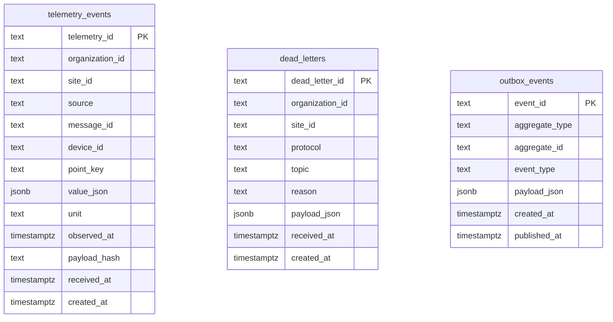

# Device Ingestion Service - Architecture Deep Dive

Status: Active (Wave 3)
Last updated: 2026-03-13
Owner: Platform architecture / service maintainers

## 1. Why this document exists

This document complements:
- `README.md` (quick start)
- code comments (local explanation)
- chat decisions (discussion history)

Goal: keep a durable, in-repo explanation of architectural and technical choices, and update it at each wave.

## 2. Scope of Wave 3

This service extracts ingestion responsibilities from Node-RED and owns:
- protocol intake (`zigbee2mqtt`, `lorawan`)
- payload normalization
- deterministic deduplication
- dead-letter capture for invalid/unprocessable input
- durable persistence for telemetry and outbox events

## 3. Core concepts

### 3.1 Dead letter
A dead letter is an ingestion message that cannot be processed safely.

In this service, that means:
- unsupported protocol (no parser)
- invalid payload format
- payload has no ingestible measurement

Instead of dropping data silently, the message is stored in `dead_letters` with:
- reason
- original payload
- topic/protocol
- tenant scope (`organization_id`, `site_id`)
- timestamps and identifier

### 3.2 Unit of Work
Unit of Work (UoW) is a transaction boundary object that groups related repository operations into one atomic commit/rollback.

Why used here:
- ingestion writes telemetry + outbox together
- either both persist or none persist
- same application flow works with `in_memory` and `postgres` backends
- domain/application logic stays independent from storage engine details

### 3.3 Protocol adapters
Wave 3 parsers currently support:
- `zigbee2mqtt`
- `lorawan`

Why these:
- they match current PoC ingestion sources
- they isolate source-specific payload shapes from core domain logic
- they make partner-specific future integrations easier (new parser, same use case contract)

## 4. Units and `_UNITS_BY_KEY`

`_UNITS_BY_KEY` maps common point keys to canonical units.
Examples:
- `temperature -> degC`
- `co2 -> ppm`
- `illuminance -> lux`

`degC` means degree Celsius (symbolic unit token), not Fahrenheit.

Important nuance:
- You are correct: temperature can arrive in Celsius or Fahrenheit.
- Current Wave 3 behavior assumes canonical telemetry input in Celsius for known keys.
- If Fahrenheit is possible from specific devices, the correct next step is to add explicit unit extraction/conversion in parser logic (for example: detect `temp_f`, convert to Celsius, and keep original unit metadata).

## 5. Data flow

### 5.1 HTTP path
1. Client calls `POST /api/v1/ingestion/events`.
2. Router builds `IngestionRequest`.
3. Use case selects parser by protocol.
4. Parser emits normalized measurements.
5. For each measurement, dedup hash is computed.
6. If duplicate within window: mark duplicate, skip write.
7. Else write telemetry + outbox in one UoW transaction.
8. Return summary (`accepted`, `duplicate`, `dead_letter`) and per-item results.

### 5.2 MQTT path
1. Worker subscribes to configured topics.
2. Incoming topic decides protocol (`topic` prefix).
3. Payload is JSON-decoded.
4. Worker calls the same ingestion use case as HTTP path.
5. Logs include counts per message (`accepted`, `duplicate`, `dead_letter`).

Design decision: one ingestion core, multiple inbound adapters.

## 6. Persistence model and schema

Tables:
- `telemetry_events`: canonical telemetry records
- `dead_letters`: unprocessable inputs
- `outbox_events`: events to publish reliably after DB commit

### 6.1 ER diagram (Mermaid)

## 7. SQL optimization strategy

Current optimizations included:
- targeted index for dedup lookup:
  - `idx_telemetry_site_payload_created(site_id, payload_hash, created_at DESC)`
- targeted index for dead-letter listing by scope/time:
  - `idx_dead_letters_scope_created(organization_id, site_id, created_at DESC)`
- partial index for unpublished outbox scanning:
  - `idx_outbox_unpublished(published_at) WHERE published_at IS NULL`

How to optimize further (recommended process):
1. Capture real query plans with `EXPLAIN (ANALYZE, BUFFERS)`.
2. Measure with representative load and cardinality.
3. Add/adjust indexes based on measured bottlenecks only.
4. Re-check write amplification and storage cost.
5. Track regressions in CI/performance environment.

Useful tools:
- PostgreSQL: `EXPLAIN ANALYZE`, `pg_stat_statements`, `auto_explain`
- Optional: pgbadger, pgMustard, HypoPG

## 8. Why `psycopg`

`psycopg` (v3) is the PostgreSQL driver used by Python code.

Why chosen:
- native PostgreSQL support
- robust typed JSON (`Jsonb`) support
- good fit for explicit SQL and transaction control
- mature ecosystem and compatibility

## 9. Why VS Code can show unresolved imports

Typical causes in this setup:
- VS Code is using the wrong interpreter (not this repo’s `.venv`).
- Workspace opened at parent folder while Python extension picked another env.
- Pylance not reloaded after dependency install.
- `python.analysis.extraPaths` not set when needed.

Quick fix checklist:
1. `Ctrl/Cmd+Shift+P` -> `Python: Select Interpreter` -> choose `device-ingestion-service/.venv/bin/python`.
2. In terminal: `source .venv/bin/activate && python -c "import fastapi,psycopg,paho.mqtt"`.
3. Reload VS Code window.
4. Ensure opened folder root is `device-ingestion-service` when working on this service.

## 10. Architectural choices made in Wave 3

1. Hexagonal structure:
- inbound adapters: HTTP + MQTT
- application: use cases + orchestration
- domain: entities + errors + repository contracts
- outbound adapters: postgres and in-memory implementations

2. Deterministic dedup:
- canonical hash from protocol/topic/site/device/message/point/value/time/unit
- dedup window configurable (default 1 hour)

3. Outbox pattern:
- outbox record written in same transaction as telemetry
- prepares reliable downstream publication without dual-write inconsistency

4. Dead-letter policy:
- explicit storage and reason codes
- no silent data loss

5. Observability baseline:
- structured logs for ingestion events
- in-process metrics snapshot endpoint (`/api/v1/ingestion/metrics`)

## 11. Known limits and next improvements

1. Unit conversion is basic (key-to-unit mapping only).
2. No dedicated outbox publisher worker yet (only persistence is implemented).
3. Metrics endpoint is in-memory; consider Prometheus exporter in later wave.
4. SQL performance validation should be done with production-like traffic profiles.

## 12. Update policy

At each wave, update this file with:
- changed architecture decisions
- added components and boundaries
- schema and protocol changes
- observed tradeoffs and unresolved risks
